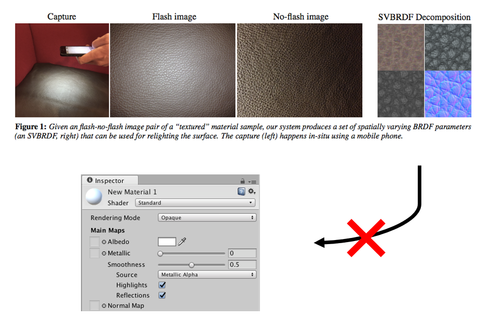

# SVBRDF Mapper

*Anisotropic GGX BRDF [left] vs. custom BRDF [right]*

This project was done at Aalto University under the supervision of Jaakko Lehtinen. Source code is not yet available.

## Motivation

A paper by [Aittala et al. (2015)](https://mediatech.aalto.fi/publications/graphics/TwoShotSVBRDF/) provides a way of capturing SVBRDF parameters of a repetetive surface using a mobile phone camera.

Unfortunately, the resulting parameter format is non-standard and unsupported by common rendering software, such as Unity or Blender. This makes the material capture difficult to use in a content creation pipeline.

 The goal of this project is therefore to find a way to convert the custom BRDF parameters to a standard set of parameters. We have chosen Anisotropic GGX.

 ## Results

 For each material separately, our program finds Anisotropic GGX parameters which give an appearance that is sufficiently close to the reference. These parameters can be directly imported into Blender and used with a correctly configured Anisotropic GGX shader.

 

 *For higher resolution, see https://youtu.be/XacVdo_5m6M (can be looped by right-clicking on the video)*