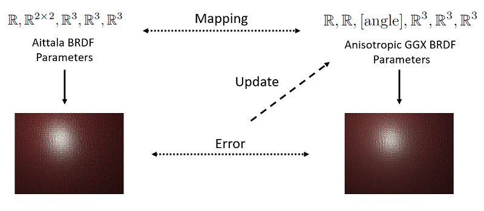

This project was done at Aalto University under the supervision of Jaakko Lehtinen. Source code is not yet available.

# Motivation

A paper by [Aittala et al. (2015)](https://mediatech.aalto.fi/publications/graphics/TwoShotSVBRDF/) provides a way of capturing SVBRDF parameters of a repetetive surface using a mobile phone camera.

Unfortunately, the resulting parameter format is non-standard and unsupported by common rendering software, such as Unity or Blender. This makes the material capture difficult to use in a content creation pipeline.

The goal of this project is therefore to find a way to convert the custom BRDF parameters to a standard set of parameters. We have chosen Anisotropic GGX.

# Results 

For each material separately, our program finds Anisotropic GGX parameters which give an appearance that is sufficiently close to the reference. These parameters can be directly imported into Blender and used with a correctly configured Anisotropic GGX shader.

*For higher resolution, see [YouTube video](https://youtu.be/XacVdo_5m6M) (can be looped by right-clicking)*

# Technical Details

The core of the program is implemented in TensorFlow and is based on non-linear optimization of the BRDF parameters. For each material, the optimization is run separately in order to ensure the best possible matching is found. Here is an overview of the whole process:

**The main problem is that the mapping cannot be uniquely determined** - for one set of Aittala parameters there can be many sets of Anisotropic GGX parameters which give the same appearance under a given lighting condition. Here is a more thorough breakdown of our approach:

1. First, initial Anisotropic GGX parameters are created as a deterministic guess function of the Aittala parameters.
2. Pairs of reference and guess materials are rendered under about 1000 different lighting conditions. 
3. Loss function is computed as an L2 distance between all reference renderings and all guess renderings combined.
4. A finite difference of the guess renderings is added to the loss function to ensure that the optimizer makes smooth changes. This term is attenuated in final stages of the optimization in order to restore sharpness.
5. After an update of the Anisotropic GGX parameters is computed, steps 2)-5) are repeated until a stopping condition is reached.

Here is a visualization of the optimization process:

