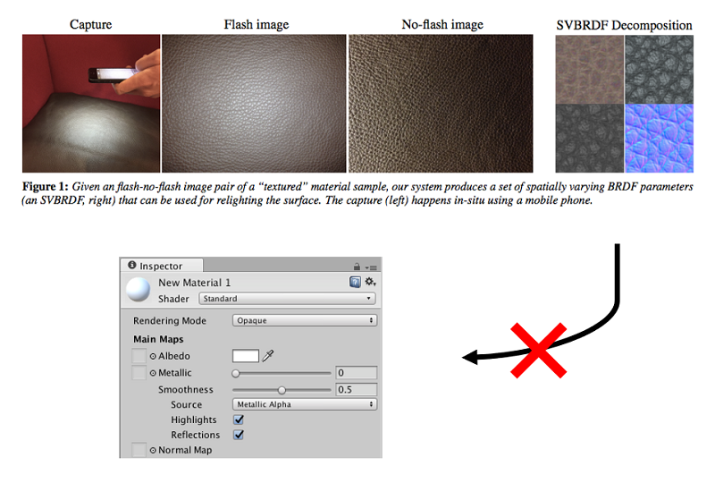

# SVBRDF Mapper

*GGX BRDF [left] vs. custom BRDF [right]*

This project was done at Aalto University under the supervision of Jaakko Lehtinen.

## Motivation

A paper by [Aittala et al. (2015)](https://mediatech.aalto.fi/publications/graphics/TwoShotSVBRDF/) provides a way of capturing SVBRDF parameters of a repetetive surface using a mobile phone camera.

Unfortunately, the resulting parameter format is non-standard and unsupported by common rendering software, such as Unity or Blender.

